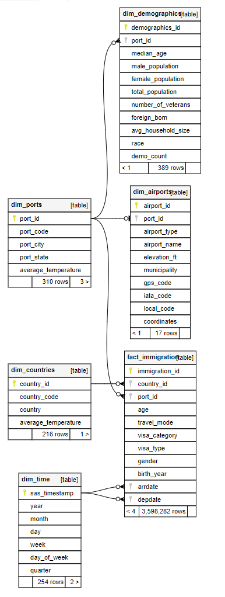
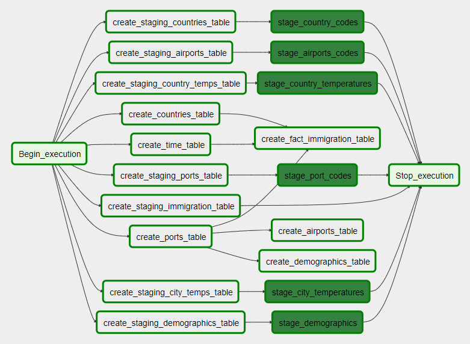
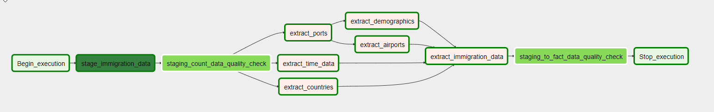

# Udacity Data Engineering Nanodegree Capstone Project

## Project Summary

This is the capstone project for the Udacity Data Engineering Nanodegree program. The idea is to take multiple data sources with no direct connection, clean the data, and process it through an ETL pipeline to produce a usable data set for analytics.

## Data Source Analysis

### I94 Immigration Data

This data comes from the U.S. National Tourism and Trade Office. A data dictionary is included in the workspace. [This](https://travel.trade.gov/research/reports/i94/historical/2016.html) is where the data comes from.

This data is stored as a set of SAS7BDAT files. SAS7BDAT is a database storage file created by Statistical Analysis System (SAS) software to store data. It contains binary encoded datasets used for advanced analytics, business intelligence, data management, predictive analytics, and more. The SAS7BDAT file format is the main format used to store SAS datasets.

The immigration data is partitioned into monthly SAS files. Each file is around 300 to 700 MB. The data provided represents 12 months of data for the year 2016. This is the bulk of the data used in the project.

A data dictionary [I94_SAS_Labels_Descriptions.SAS](./docs/I94_SAS_Labels_Descriptions.SAS) was provided for the immigration data. In addition to descriptions of the various fields, the port and country codes used were listed in table format. I extracted the port codes to a file [i94_ports.csv](./data/i94_ports.csv). I extracted the country codes to a file [i94_countries.csv](./data/i94_countries.csv). These files were placed in the data lake to be used as a lookup when extracting the immigration data.

The SAS format can be read fairly easily with pandas in python or Apache Spark.

Read SAS data with pandas example:

```python
import pandas as pd
fname = '../../data/18-83510-I94-Data-2016/i94_apr16_sub.sas7bdat'
df = pd.read_sas(fname, 'sas7bdat', encoding="ISO-8859-1")
```

In order to load this data into Apache Spark, I added the following JAR packages to my Spark environment:

* Spark-sas7bdat-2.1.0-s_2.11
  * https://github.com/saurfang/spark-sas7bdat
* Parso-2.0.11
  * https://mvnrepository.com/artifact/com.epam/parso/2.0.11

Reading SAS data with Spark:

```python
df = spark.read.format("com.github.saurfang.sas.spark").load(input_path)
```

Since this dataset is fairly large and it was provided on an attached disk in a JupyterLab environment provided by Udacity, I decided to preprocess it with PySpark in that environment and load it to Amazon S3. I created a PySpark script to extract the SAS data and write to Parquet format. The Parquet data is partitioned by year, month, and day based on the arrival date of the immigrant. This breaks the monthly SAS immigration data down into easier to manage partitions which can be later backfilled through the Apache Airflow pipeline on a daily cadence.

See [src/spark/extract_immigration_sas.py](./src/spark/extract_immigration_sas.py)

### World Temperature Data

This dataset came from Kaggle. You can read more about it [here](https://www.kaggle.com/berkeleyearth/climate-change-earth-surface-temperature-data).

With this data set I used two sources:

* GlobalLandTemperaturesByCity.csv (508 MB)
* GlobalLandTemperaturesByCountry.csv (21.6 MB)

These files contain average temperature data for countries and cities between 1743-11-01 and 2013-09-01. For the city data, I only pulled cities in the United States since we are interested in immigration through U.S. ports. This temperature data would be applied to the port cities extracted from the immigration data. Since the data all fell prior to 2016, I only pulled the latest entry for each city where a temperature was recorded.

Similarly, with the country data I pulled the latest entry that had temperature data for each country. This country data would be applied to the immigration data country of origin.

Both sets of data were extracted one time using Apache Spark and placed in a data lake in Amazon S3 in Parquet format for later processing.

See [src/spark/extract_immigration_sas.py](./src/spark/extract_immigration_sas.py)

### U.S. City Demographic Data

This data comes from OpenSoft. You can read more about it [here](https://public.opendatasoft.com/explore/dataset/us-cities-demographics/export/).

This data contains demographic data for U.S. cities. This data placed in the data lake as a single CSV file (246 KB). This data will be combined with port city data to provide ancillary demographic info for port cities.

### Airport Code Table

This is a simple table of airport codes and corresponding cities. It comes from [here](https://datahub.io/core/airport-codes#data).

This data is a single CSV file (5.8 KB). It provides additional information for airports and can be combined with the immigration port city info.

## Data Model

For this project I went with a [snowflake schema](https://en.wikipedia.org/wiki/Snowflake_schema). There is one fact table with the main immigration data with multiple dimension tables surrounding it. Some of the dimension tables are connected to other dimension tables. For instance, ports have demographics and optional airport information.

### dim_ports

|Field|Type|Description|
|----|-----|-----------|
|port_id|int8|Primary Key|
|port_code|varchar(3) not null|3 character code used for I94 ports|
|port_state|varchar(50)|U.S. state of port|
|average_temperature|numeric(16,3)|Average temperature of port city|

### dim_countries

|Field|Type|Description|
|----|-----|-----------|
|country_id|int8|Primary Key|
|country_code|varchar(3) not null|3 character code used for I94 countries|
|average_temperature|numeric(16,3)|Average temperature of country|

### dim_time

|Field|Type|Description|
|----|-----|-----------|
|sas_timestamp|int4| Primary Key - The SAS timestamp (days since 1/1/1960)|
|year|int4|4 digit year|
|month|int4|Month (1-12)|
|day|int4|Day (1-31)|
|week|int4|Week of Year (1-52)|
|day_of_week|int4|Day of Week (0-6) starting on Sunday|
|quarter|int4|Quarter of Year (1-4)|

### dim_demographics

|Field|Type|Description|
|----|-----|-----------|
|demographics_id|int8|Primary Key|
|port_id|int8|Foreign key to dim_ports|
|median_age|numeric(18,2)|The median age for the demographic|
|male_population|int4|Count of male population for city|
|female_population|int4|Count of female population for city|
|total_population|int8|Count of population for city|
|num_of_veterans|int4|Count of veterans|
|foreign_born|int4|Count of foreign born persons|
|avg_household_size|numeric(18,2)|Average household size in city|
|race|varchar(100)|Race for this demographic|
|demo_count|int4|Count for this demographic|

### dim_airports

|Field|Type|Description|
|----|-----|-----------|
|airport_id|int8|Primary Key|
|port_id|int4|Foreign key to dim_ports|
|airport_type|varchar(256)|Short description of airport type|
|airport_name|varchar(256)|Airport Name|
|elevation_ft|int4|Airport elevation|
|municipality|varchar(256)|Airport municipality|
|gps_code|varchar(256)|Airport GPS code|
|iata_code|varchar(256)|Airport International Air Transport Association code|
|local_code|varchar(256)|Airport local code|
|coordinates|varchar(256)|Airport Coordinates|

### fact_immigration

|Field|Type|Description|
|----|-----|-----------|
|immigration_id|int8|Primary Key|
|country_id|int8|Foreign key to dim_countries|
|port_id|int8|Foreign Key to dim_ports|
|age|int4|Age of immigrant|
|travel_mode|varchar(100)|Mode of travel for immigrant (air, sea, land, etc.)|
|visa_category|varchar(100)|Immigrant VISA category|
|visa_type|varchar(100)|Type of VISA|
|gender|varchar(10)|Immigrant gender|
|birth_year|int4|Immigrant birth year|
|arrdate|int4|SAS timestamp of arrival date, Foreign key to dim_time|
|depdate|int4|SAS timestamp of departure date, Foreign key to dim_time|


### Data Model Entity Relationship Diagram



## Data Pipeline

The main data pipeline uses Apache Airflow to process immigration data for  single day at a time. In brings in the immigration data from Amazon S3 and combines it with other staging data for ports, airport data, countries, city and country temperatures, and city demographics.

Airflow uses directed acyclic graphs (DAG's) to describe a pipeline workflow. Each DAG is made up of tasks which are the nodes of the graph. Each task implements an operator of some type to execute code.

Ultimately I wanted to use Amazon Redshift as the data warehouse, but in order to avoid the cost of Redshift I did most of the early development against a local copy of PostgreSQL.

I created four DAG's, two for Postgres and two for Amazon Redshift:

* setup_postgres.py -  This DAG is responsible for creating the schema within a Postgres database and loading some static staging data.
* setup_redshift.py -  This DAG is responsible for creating the schema within an Amazon Redshift database and loading some static staging data.



* import_i94_postgres.py -  This DAG loads the immigration data into a staging table in Postgres and then combines it with other staging data to produce the final dimension and fact table entries that are inserted.
* import_i94_redshift.py -  This DAG loads the immigration data into a staging table in Redshift and then combines it with other staging data to produce the final dimension and fact table entries that are inserted.



### Custom Apache Airflow Operators

I created four custom Apache Airflow operators to use within the pipeline.

* DataQualityOperator - This operator takes a database connection ID
  * conn_id - The Airflow connection ID for a Postgres or Redshift database
  * sql_check_query - The SQL query used as a data quality check
  * expected_results - A lambda function that acts as a predicate to test the results of the query above
* StageToRedshiftOperator - This operator makes it easy to move data in various formats from S3 to a staging table in Redshift
  * redshift_conn_id - The Redshift Airflow connection ID
  * aws_credentials_id - The Airflow connection ID for AWS (used for access to S3)
  * table_name - The staging table name to write to
  * s3_path - The path of the S3 bucket to read data from (this field is templated)
  * copy_format - The format of the source data (CSV, AVRO, PARQUET, etc.)
  * truncate_table - If true the table is truncated prior to adding new data
* StageCsvToPostgresOperator - Moves CSV data into Postgres using COPY statement.
  * postgres_conn_id - The Airflow connection ID for a Postgres database
  * csv_path - The path to CSV file accessible from Postgres server
  * table_name - The staging table name to load data into
  * delimiter - The delimiter of the CSV file
  * truncate_table - If true the table is truncated prior to adding new data
* StageParquetToPostgres - Moves Parquet data to Postgres staging table. Postgres has no built-in COPY operator for Parquet so this uses python pandas to read and load the data.
  * postgres_conn_id - The Airflow connection ID for a Postgres database
  * parquet_path - The path to Parquet file accessible from Postgres server (this field is templated to allow for partitioned data load based on execution date)
  * table_name - The staging table name to load data into
  * truncate_table - If true the table is truncated prior to adding new data

## Data Quality

There are two data quality checks within the pipeline.

* staging_count_data_quality_check - This task uses a DataQualityOperator custom airflow operator. The check ensures that after staging the immigration data for a particular data from Amazon S3 to Amazon Redshift that we have records in the staging table. While it is possible that a particular day might not have any records, it would be highly unlikely and at the very least should be investigated.
* staging_to_fact_data_quality_check - This task also uses the DataQualityOperator custom Airflow operator. This check ensures that the right amount of data was added to our immigration fact table from the staging table. It looks at the count of records for a particular day in the fact table vs. the count of records in the staging table and compares.

Failure to meet the criteria of the data quality check will result in a failure of that particular run in Airflow.

In addition to these two checks, foreign key constraints were used to ensure data integrity between the dimension tables and the fact table.

## Questions
