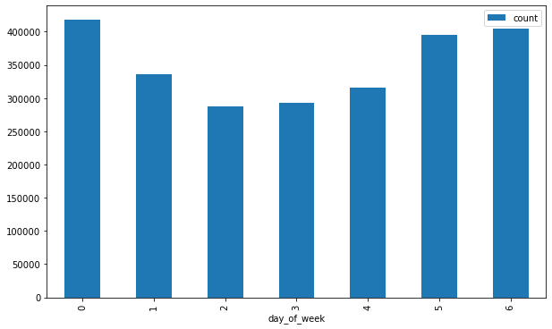

# Udacity Data Engineering Nanodegree Capstone Project

## Project Summary

This is the capstone project for the Udacity Data Engineering Nanodegree program. The idea is to take multiple disparate data sources, clean the data, and process it through an ETL pipeline to produce a usable data set for analytics.

I decided to go with the Udacity provided project which is based on I94 immigration data. This is a large data set which contains immigration data for U.S. ports. The plan is to enrich this data using the other data sources suggested and create a working data warehouse which can be used for analytics.

At a high level:

* Data is extracted from the immigration SAS data, partitioned by year, month, and day, and stored in a data lake on Amazon S3 as Parquet files.
* The partitioned data is loaded into Redshift into staging tables
* The staging data is combined with other staged data sources to produce the final fact and dimension records in the Redshift warehouse.

Ideas on questions we could explore with the final data set:

* For a given port city, how many immigrants enter from which countries?
* What are the demographics of the port city and is there any relationship to the country of origin?
* Is there any relationship between the average temperature of the country of origin and average temperature of the port city of entry?
* What time of year or month sees more immigration for certain areas?

## Data Source Analysis

### I94 Immigration Data

This data comes from the U.S. National Tourism and Trade Office. A data dictionary is included in the workspace. [This](https://travel.trade.gov/research/reports/i94/historical/2016.html) is where the data comes from.

This data is stored as a set of SAS7BDAT files. SAS7BDAT is a database storage file created by Statistical Analysis System (SAS) software to store data. It contains binary encoded datasets used for advanced analytics, business intelligence, data management, predictive analytics, and more. The SAS7BDAT file format is the main format used to store SAS datasets.

The immigration data is partitioned into monthly SAS files. Each file is around 300 to 700 MB. The data provided represents 12 months of data for the year 2016. This is the bulk of the data used in the project.

A data dictionary [I94_SAS_Labels_Descriptions.SAS](./docs/I94_SAS_Labels_Descriptions.SAS) was provided for the immigration data. In addition to descriptions of the various fields, the port and country codes used were listed in table format. I extracted the port codes to a file [i94_ports.csv](./data/i94_ports.csv). I extracted the country codes to a file [i94_countries.csv](./data/i94_countries.csv). These files were placed in the data lake to be used as a lookup when extracting the immigration data.

The SAS format can be read fairly easily with pandas in python or Apache Spark.

Read SAS data with pandas example:

```python
import pandas as pd
fname = '../../data/18-83510-I94-Data-2016/i94_apr16_sub.sas7bdat'
df = pd.read_sas(fname, 'sas7bdat', encoding="ISO-8859-1")
```

In order to load this data into Apache Spark, I added the following JAR packages to my Spark environment:

* Spark-sas7bdat-2.1.0-s_2.11
  * https://github.com/saurfang/spark-sas7bdat
* Parso-2.0.11
  * https://mvnrepository.com/artifact/com.epam/parso/2.0.11

Reading SAS data with Spark:

```python
df = spark.read.format("com.github.saurfang.sas.spark").load(input_path)
```

Since this dataset is fairly large and it was provided on an attached disk in a JupyterLab environment provided by Udacity, I decided to preprocess it with PySpark in that environment and load it to Amazon S3. I created a PySpark script to extract the SAS data and write to Parquet format. The Parquet data is partitioned by year, month, and day based on the arrival date of the immigrant. This breaks the monthly SAS immigration data down into easier to manage partitions which can be later backfilled through the Apache Airflow pipeline on a daily cadence.

See [src/spark/extract_immigration_sas.py](./src/spark/extract_immigration_sas.py)

### World Temperature Data

This dataset came from Kaggle. You can read more about it [here](https://www.kaggle.com/berkeleyearth/climate-change-earth-surface-temperature-data).

With this data set I used two sources:

* GlobalLandTemperaturesByCity.csv (508 MB)
* GlobalLandTemperaturesByCountry.csv (21.6 MB)

These files contain average temperature data for countries and cities between 1743-11-01 and 2013-09-01. For the city data, I only pulled cities in the United States since we are interested in immigration through U.S. ports. This temperature data would be applied to the port cities extracted from the immigration data. Since the data all fell prior to 2016, I only pulled the latest entry for each city where a temperature was recorded.

Similarly, with the country data I pulled the latest entry that had temperature data for each country. This country data would be applied to the immigration data country of origin.

Both sets of data were extracted one time using Apache Spark and placed in a data lake in Amazon S3 in Parquet format for later processing.

See [src/spark/extract_immigration_sas.py](./src/spark/extract_immigration_sas.py)

### U.S. City Demographic Data

This data comes from OpenSoft. You can read more about it [here](https://public.opendatasoft.com/explore/dataset/us-cities-demographics/export/).

This data contains demographic data for U.S. cities. This data placed in the data lake as a single CSV file (246 KB). This data will be combined with port city data to provide ancillary demographic info for port cities.

### Airport Code Table

This is a simple table of airport codes and corresponding cities. It comes from [here](https://datahub.io/core/airport-codes#data).

This data is a single CSV file (5.8 KB). It provides additional information for airports and can be combined with the immigration port city info.

## Data Model

For this project I went with a [snowflake schema](https://en.wikipedia.org/wiki/Snowflake_schema). There is one fact table with the main immigration data with multiple dimension tables surrounding it. Some of the dimension tables are connected to other dimension tables. For instance, ports have demographics and optional airport information.

[Data Dictionary](./docs/data_dictionary.md)

### Data Model Entity Relationship Diagram


## Choice of Technologies

The main technologies used are:

* Amazon S3 - I used S3 for data lake storage of the data to be processed. While we are building a data warehouse for a certain type of analysis, the data lake contains the cleaned raw data which could be used for a different type of analysis at a later time.
* Apache Spark - I used Spark primarily to extract, clean, and partition the immigration data. Because the data was provided in a JupyterLab with attached storage and the files are so large, I decided to preprocess the data through Spark in that environment. In production we would probably add a DAG to Apache Airflow to submit a job to a Spark cluster on a monthly basis or as needed.
* Apache Airflow - I used Apache Airflow as a tool for the primary data pipeline. The pipeline schedules and coordinates the flow of data from the S3 data lake to Amazon Redshift and performs quality checks along the way. Airflow makes it easy to set up the pipeline and make adjustments as requirements change over time.

## Data Pipeline

The main data pipeline uses Apache Airflow to process immigration data for  single day at a time. In brings in the immigration data from Amazon S3 and combines it with other staging data for ports, airport data, countries, city and country temperatures, and city demographics.

Airflow uses directed acyclic graphs (DAG's) to describe a pipeline workflow. Each DAG is made up of tasks which are the nodes of the graph. Each task implements an operator of some type to execute code.

Ultimately I wanted to use Amazon Redshift as the data warehouse, but in order to avoid the cost of running a Redshift cluster, I did most of the early development against a local copy of PostgreSQL.

I created four DAG's, two for Postgres and two for Amazon Redshift:

* setup_postgres.py -  This DAG is responsible for creating the schema within a Postgres database and loading some static staging data.
* setup_redshift.py -  This DAG is responsible for creating the schema within an Amazon Redshift database and loading some static staging data.


* import_i94_postgres.py -  This DAG loads the immigration data into a staging table in Postgres and then combines it with other staging data to produce the final dimension and fact table entries that are inserted.
* import_i94_redshift.py -  This DAG loads the immigration data into a staging table in Redshift and then combines it with other staging data to produce the final dimension and fact table entries that are inserted.


### Custom Apache Airflow Operators

I created four custom Apache Airflow operators to use within the pipeline.

* DataQualityOperator - This operator takes a database connection ID
  * conn_id - The Airflow connection ID for a Postgres or Redshift database
  * sql_check_query - The SQL query used as a data quality check
  * expected_results - A lambda function that acts as a predicate to test the results of the query above
* StageToRedshiftOperator - This operator makes it easy to move data in various formats from S3 to a staging table in Redshift
  * redshift_conn_id - The Redshift Airflow connection ID
  * aws_credentials_id - The Airflow connection ID for AWS (used for access to S3)
  * table_name - The staging table name to write to
  * s3_path - The path of the S3 bucket to read data from (this field is templated)
  * copy_format - The format of the source data (CSV, AVRO, PARQUET, etc.)
  * truncate_table - If true the table is truncated prior to adding new data
* StageCsvToPostgresOperator - Moves CSV data into Postgres using COPY statement.
  * postgres_conn_id - The Airflow connection ID for a Postgres database
  * csv_path - The path to CSV file accessible from Postgres server
  * table_name - The staging table name to load data into
  * delimiter - The delimiter of the CSV file
  * truncate_table - If true the table is truncated prior to adding new data
* StageParquetToPostgres - Moves Parquet data to Postgres staging table. Postgres has no built-in COPY operator for Parquet so this uses python pandas to read and load the data.
  * postgres_conn_id - The Airflow connection ID for a Postgres database
  * parquet_path - The path to Parquet file accessible from Postgres server (this field is templated to allow for partitioned data load based on execution date)
  * table_name - The staging table name to load data into
  * truncate_table - If true the table is truncated prior to adding new data

## Data Quality

There are two data quality checks within the pipeline.

* staging_count_data_quality_check - This task uses a DataQualityOperator custom airflow operator. The check ensures that after staging the immigration data for a particular data from Amazon S3 to Amazon Redshift that we have records in the staging table. While it is possible that a particular day might not have any records, it would be highly unlikely and at the very least should be investigated.
* staging_to_fact_data_quality_check - This task also uses the DataQualityOperator custom Airflow operator. This check ensures that the right amount of data was added to our immigration fact table from the staging table. It looks at the count of records for a particular day in the fact table vs. the count of records in the staging table and compares.

Failure to meet the criteria of the data quality check will result in a failure of that particular run in Airflow.

In addition to these two checks, foreign key constraints were used to ensure data integrity between the dimension tables and the fact table.

## Questions

We are asked to answer how we would approach the problem differently under the following scenarios:

* If the data was increased by 100x.
  * I had no trouble processing the data while in development using Postgres and pandas on a single machine. Primarily the partitioning of the data makes this work. If the data were increased 100x, then we should be able to easily handle it using Spark and Redshift and scaling the clusters as needed. Since the immigration data was provided in files of one month at a time, I assume we would be processing that through Spark, breaking it down into day partitions, and then back-filling through the Airflow pipeline one day at a time.
* If the pipelines were run on a daily basis by 7am.
  * The pipeline is already set to run daily. The time taken to process a day is a matter of minutes. We might modify the scheduling to a specific time of day and introduce an SLA in Airflow to ensure jobs are completed in a timely manner and adjust accordingly.
* If the database needed to be accessed by 100+ people
  * Amazon Redshift as a data warehouse should have no issues with this and can be scaled as needed.

## Example Data Usage

```sql
--Immigrants arrivals by country for month of January

SELECT c.country, COUNT(*) FROM fact_immigration i
INNER JOIN dim_countries c ON i.country_id = c.country_id
INNER JOIN dim_time t ON i.arrdate=t.sas_timestamp
WHERE t.year=2016 AND t.month=1
GROUP BY c.country
ORDER BY count DESC
LIMIT 10
```


```sql
--Top 10 immigrants by port of entry for month of January

SELECT p.port_city, p.port_state, COUNT(*) as count
FROM fact_immigration i
INNER JOIN dim_ports p ON i.port_id = p.port_id
INNER JOIN dim_time t ON i.arrdate=t.sas_timestamp
WHERE t.year=2016 AND t.month=1
GROUP BY p.port_city, p.port_state
ORDER BY count DESC
LIMIT 10
```


```sql
-- Arrivals by day of week

SELECT t.day_of_week,COUNT(*) as count
FROM fact_immigration i
INNER JOIN dim_ports p ON i.port_id = p.port_id
INNER JOIN dim_time t ON i.arrdate=t.sas_timestamp
WHERE t.year=2016 AND t.month=1
GROUP BY t.day_of_week
ORDER BY t.day_of_week
```



## Setup Instructions

### Environment

For my environment, I used the following:

* Apache Airflow version 1.10.10
* Python version 3.7.6
* Apache Spark version 2.4.3

### Setup

1. Copy the contents of the /src/airflow/plugins folder to you Airflow plugins folder.
1. Add the DAG's from /arc/airflow/dags to your Airflow dags folder. There are two sets, one for Postgres and one for Redshift.
1. Configure the connections in Airflow for your database and AWS S3 (if you are using Redshift).
1. You will need the data sources listed, but the immigration data is behind a pay wall so this may not be an option.

There is a [notebook](/deploy/deploy_redshift_cluster.ipynb) that I used to deploy the Redshift cluster when needed.
